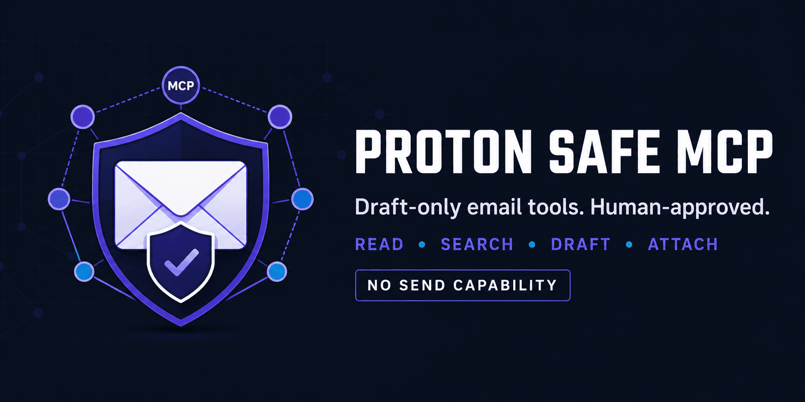

# Proton Safe MCP

[](https://github.com/fbossiere/proton-safe-mcp/actions/workflows/ci.yml)
[](https://fbossiere.github.io/proton-safe-mcp/)
[](https://www.python.org/downloads/)
[](LICENSE)
[](https://mypy-lang.org/)
[](https://github.com/astral-sh/ruff)



A client-agnostic [FastMCP](https://gofastmcp.com) server for Proton Mail through the official [Proton Mail Bridge](https://proton.me/mail/bridge). It can read and search mail and create **drafts with attachments**. It deliberately **cannot send email** — you review every draft in Proton Mail and press Send yourself.

The server runs locally over STDIO for any MCP-compatible client (Claude Desktop, Claude Code, or anything else that speaks MCP). Attachments are uploaded as bounded base64 chunks through MCP tools, so the server never receives or reads a client filesystem path.

Read the [full documentation](https://fbossiere.github.io/proton-safe-mcp/) for setup, configuration, tool inputs, security boundaries, and troubleshooting.

## Why "safe"?

Email is attacker-controlled input. Any sender can put adversarial instructions in a message body, and an AI agent that reads mail *and* holds write-capable tools is one prompt injection away from doing something you did not ask for. This project limits the blast radius by construction:

- **No send.** There is no SMTP client and no `send_message` tool in the codebase — a test asserts it.
- **No delete, no move,** no received-attachment download tool.
- **Human in the loop.** Creating a draft requires an interactive approval in a local terminal that is *not* exposed as an MCP tool.
- **No filesystem access for clients.** Attachment bytes are streamed in chunks with declared size and SHA-256 verification; paths are rejected.
- **Loopback only.** STDIO transport, no listening socket, and the Bridge host is hard-coded to `127.0.0.1`.

These controls reduce risk but do not make email trusted. Never expose unrelated write-capable tools in the same unattended agent workflow.

## Architecture

```text
┌────────────┐  STDIO / MCP   ┌───────────────────┐  IMAP (loopback)  ┌───────────────┐
│ MCP client │ ─────────────► │  proton-safe-mcp  │ ────────────────► │ Proton Bridge │
│ (any)      │   tools only   │                   │   127.0.0.1 only  │ (local)       │
└────────────┘                │  ├─ read tools    │                   └──────┬────────┘
                              │  ├─ chunked       │                          │ E2E-encrypted
      you, in a terminal      │  │  attachment    │                          ▼
┌────────────────────────┐    │  │  staging       │                   ┌───────────────┐
│ proton-safe-mcp        │───►│  └─ draft         │                   │  Proton Mail  │
│   approve <draft_id>   │    │     proposals     │                   │  (Drafts)     │
└────────────────────────┘    └───────────────────┘                   └───────────────┘
        out-of-band approval — not an MCP tool
```

## Security properties

- STDIO only: the server opens no listening network socket.
- Proton Bridge host is hard-coded to `127.0.0.1` (`PROTON_BRIDGE_HOST` is intentionally unsupported).
- No SMTP client, send tool, delete tool, move tool, or received-attachment download tool.
- Message reads use `BODY.PEEK`, return plain text, omit attachment bytes, and cap body length.
- Attachment input is chunked base64 with declared size and SHA-256 verification.
- Only PDF, DOCX, XLSX, PPTX, TXT, CSV, PNG, and JPEG uploads are accepted.
- Attachment tokens are random, short-lived, single-use, and reverified before draft creation.
- Draft creation requires a separate local terminal approval that is not exposed as an MCP tool.
- The Bridge-generated IMAP password is stored in the operating-system keyring.
- Recipient, subject, and folder inputs are validated against header/criteria injection.
- State files are private to the Unix account (`0700` directories, `0600` files, `O_NOFOLLOW`).

## Requirements

- Linux with the official Proton Mail Bridge installed, signed in, and running (developed and tested on Ubuntu).
- A Proton plan that supports Bridge.
- Python 3.11 or newer.
- [`uv`](https://docs.astral.sh/uv/).
- A working Secret Service keyring (`gnome-keyring` or compatible).

## Installation

```bash
git clone https://github.com/fbossiere/proton-safe-mcp.git
cd proton-safe-mcp
uv sync
```

Set only the Proton address and Bridge IMAP port in the MCP process environment:

```bash
export PROTON_BRIDGE_USER="your-address@proton.me"
export PROTON_IMAP_PORT="1143"
```

Store the **Bridge-generated IMAP password** (shown in the Bridge UI), not your Proton account password:

```bash
uv run proton-safe-mcp setup
```

The value shown by Bridge is installation-specific and works only against the local Bridge.

## Register with an MCP client

Configure a local STDIO server with these logical fields. The exact configuration syntax belongs to the MCP client, not to this project:

```json
{
  "name": "proton-safe",
  "transport": "stdio",
  "command": "/absolute/path/to/proton-safe-mcp/.venv/bin/proton-safe-mcp",
  "args": ["serve"],
  "env": {
    "PROTON_BRIDGE_USER": "your-address@proton.me",
    "PROTON_IMAP_PORT": "1143"
  }
}
```

Do not put `PROTON_BRIDGE_PASSWORD` in the client configuration. The server reads it from the OS keyring established by `setup`.

## Available MCP tools

| Category | Tool | Notes |
| --- | --- | --- |
| Read-only mail | `mailbox_status` | Bridge connectivity + INBOX counts |
| | `list_folders` | |
| | `list_messages` | Never marks messages as read |
| | `search_messages` | Injection-safe IMAP `TEXT` search |
| | `read_message` | Bounded plain text; no attachment bytes |
| Attachment staging | `begin_attachment_upload` | Declares filename, type, size, SHA-256 |
| | `upload_attachment_chunk` | Ordered base64 chunks |
| | `finish_attachment_upload` | Verifies hash, returns single-use token |
| | `discard_attachment` | |
| Drafts | `prepare_draft` | Creates a pending proposal only |
| | `commit_approved_draft` | Requires prior out-of-band approval |

There is deliberately no `send_message` tool.

## Attachment and draft workflow

The MCP client only needs the ability to obtain the bytes of a file and call tools. There is no dependency on a particular client, service, or local directory.

1. Calculate the exact byte length and SHA-256 of the file.
2. Call `begin_attachment_upload(filename, content_type, size_bytes, sha256_hex)`.
3. Base64-encode consecutive binary chunks no larger than the returned `max_chunk_bytes`.
4. Call `upload_attachment_chunk(upload_id, chunk_index, data_base64)` for indexes `0, 1, 2…`.
5. Call `finish_attachment_upload(upload_id)` and retain the returned `attachment_token`.
6. Call `prepare_draft(..., attachment_tokens=[token])`.
7. Inspect and approve the exact proposal in a local terminal:

   ```bash
   export PROTON_BRIDGE_USER="your-address@proton.me"
   /absolute/path/to/.venv/bin/proton-safe-mcp approve <draft_id>
   ```

8. Allow the MCP client to call `commit_approved_draft(draft_id)`.
9. Open Proton Mail, review the draft, and send it manually.

The proposal expires after 15 minutes by default. Uploaded attachments expire after 30 minutes. The server intentionally keeps draft bodies in memory only; restarting it invalidates all pending proposals.

## Local administration

```bash
proton-safe-mcp show <draft_id>      # inspect a pending draft
proton-safe-mcp approve <draft_id>   # interactive; no --yes bypass exists
proton-safe-mcp reject <draft_id>
```

## Configuration reference

| Variable | Default | Purpose |
| --- | ---: | --- |
| `PROTON_BRIDGE_USER` | required | Proton address configured in Bridge |
| `PROTON_IMAP_PORT` | `1143` | Local Bridge IMAP port |
| `PROTON_MCP_STATE_DIR` | `~/.local/state/proton-safe-mcp` | Private staging and approval state |
| `PROTON_MCP_MAX_ATTACHMENT_BYTES` | `20971520` | Per-file maximum, capped at 25 MiB |
| `PROTON_MCP_MAX_CHUNK_BYTES` | `393216` | Decoded chunk maximum, capped at 1 MiB |
| `PROTON_MCP_UPLOAD_TTL_SECONDS` | `1800` | Attachment staging lifetime |
| `PROTON_MCP_DRAFT_TTL_SECONDS` | `900` | Pending draft lifetime |
| `PROTON_MCP_MAX_BODY_CHARS` | `100000` | Maximum outgoing draft body length |

`PROTON_BRIDGE_HOST` is intentionally unsupported.

For isolated containers without a Secret Service keyring, `PROTON_BRIDGE_PASSWORD` may contain
the Bridge-generated IMAP password. Avoid this fallback in desktop MCP client configuration:
environment values may be visible to the client process or its diagnostics.

## Development

```bash
uv sync --extra dev
uv run pytest --cov      # tests with coverage
uv run ruff check .      # lint
uv run ruff format .     # format
uv run mypy              # strict type checking
```

Proton Bridge is not needed for development: the test suite fakes the IMAP layer. Tests cover path rejection, MIME restrictions, ordered chunks, size/hash verification, token consumption, header injection, approval digest integrity, CLI approval flow, and HTML-to-text sanitization.

See [CONTRIBUTING.md](CONTRIBUTING.md) for the design rules that reviews enforce.

## Threat-model limitations

Read this before relying on the server in an autonomous workflow:

- A model necessarily sees any mail it reads and any attachment it creates or uploads.
- Uploaded attachment bytes are stored temporarily in files readable only by the Unix account. Use full-disk encryption.
- If the MCP client also has unrestricted shell access as the same Unix user, it can potentially write an approval marker itself. Keep shell/file-writing tools out of the same autonomous agent session when approval integrity matters.
- Tool annotations are hints for clients, not authorization controls. The server enforces its own validation and local approval.
- Proton Bridge's self-signed TLS certificate is not verified. This is acceptable here only because the target host is unchangeably `127.0.0.1`.

## Security

To report a vulnerability, use [GitHub private vulnerability reporting](https://github.com/fbossiere/proton-safe-mcp/security/advisories/new) — never a public issue. See [SECURITY.md](SECURITY.md).

## License

[MIT](LICENSE) © 2026 Francois Bossiere.

This project is not affiliated with or endorsed by Proton AG. "Proton Mail" and "Proton Mail Bridge" are trademarks of Proton AG.
