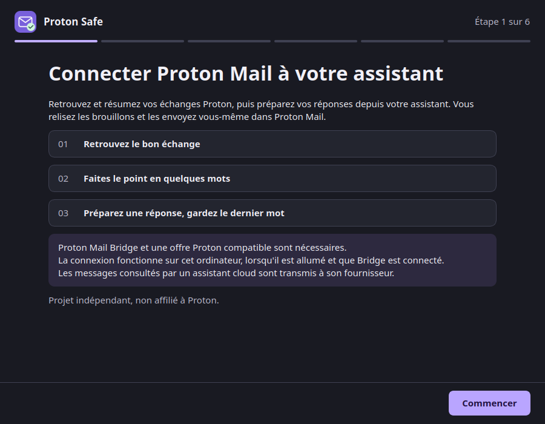

# Desktop setup assistant (Ubuntu)

The setup assistant is a native application that connects Proton Mail to a local AI
assistant without a terminal, without installing Python or `uv`, and without editing any
configuration file by hand. It reuses this project's MCP server, its keyring handling, its
diagnostics and its three plugin skills.

The command-line path documented in [Getting started](getting-started.md) is unchanged and
stays supported. Nothing in the assistant modifies an existing CLI installation.

!!! info "Validation status"
    On 13 September 2026, the maintainer reported that the installed assistant was tested
    successfully in their own environment. Automated tests also exercise the interface and
    packaged runtime. This is a successful user test, not a completed record of all eleven
    acceptance scenarios. See [Desktop validation](desktop-testing.md) for the evidence and
    remaining scenario-level checks.

## Interface preview

The native window follows the system's light or dark palette. A six-step progress indicator,
a bounded reading column and persistent navigation keep the flow readable. On smaller
screens, the content scrolls while **Back**, **Cancel** and the main action stay in view.
The Bridge form starts with the address and password; expand **Advanced options** to
change the IMAP port or add sending addresses.

These are real Qt widget renders with synthetic data, not evidence of a working Bridge or
client connection. The interface follows the session's French or English locale.




## What it is for

| Goal | How the assistant does it |
|---|---|
| Configure Bridge without a terminal | A form for the address and port; the Bridge password is typed into the application and stored in the session keyring. |
| Enable the existing plugin | It renders the three canonical skills and an MCP configuration into a local marketplace, then asks the client to install it. |
| Check the result | Three separate levels: Bridge connected, server ready, connection active in the client. |
| Repair a connection | It re-checks reality and fixes only what differs. |
| Remove a connection | It takes back only the entries it created. |

## Supported scope

| Item | V1 |
|---|---|
| Operating system | Ubuntu 24.04 LTS, x86_64. Another Linux runs but is reported as outside the validated scope. |
| Session | A normal graphical session (Wayland or X11), never root. |
| Keyring | Secret Service (`gnome-keyring`). No fallback to a file or the environment. |
| Client | ChatGPT desktop / Codex sharing one local Codex host. |
| Transport | STDIO on this computer only. No tunnel, no listening socket. |
| Not in V1 | ChatGPT web or mobile, remote Bridge, macOS, Windows, ARM, WSL, multiple accounts, automatic updates. |

Proton Mail Bridge is **not** installed by the assistant. Install it from
[proton.me/mail/bridge](https://proton.me/mail/bridge) and sign in there first: your Proton
password, second factor and session stay entirely inside Bridge.

## Install

Download [the Ubuntu 24.04 x86_64 installer](https://github.com/fbossiere/proton-safe-mcp/releases/download/v2.1.0/proton-safe-assistant_2.1.0_amd64.deb)
from the [v2.1.0 release](https://github.com/fbossiere/proton-safe-mcp/releases/tag/v2.1.0).
Open it with Ubuntu's graphical package installer, then launch **Proton Safe** from the
applications menu. Python and `uv` are bundled; you do not need to install them.

You need Proton Mail Bridge, a Proton plan that supports Bridge, a session keyring and a
compatible local ChatGPT desktop / Codex installation on the same computer.

The release also carries a `.sha256` file and `BUILD-PROVENANCE.txt` naming the source
commit and build host. To verify a download, put the `.deb` and its `.sha256` file together
and run `sha256sum -c proton-safe-assistant_2.1.0_amd64.deb.sha256`.
CI artefacts remain available for testing unreleased changes, and the scripts in
`packaging/` support building from source.

It places:

```text
/opt/proton-safe-assistant/proton-safe-assistant   # the interface
/opt/proton-safe-assistant/proton-safe-mcp         # the MCP runtime it launches
/usr/bin/proton-safe-assistant                     # the only entry point on PATH
/usr/share/applications/proton-safe-assistant.desktop
```

The runtime deliberately stays in `/opt`. A `proton-safe-mcp` you installed yourself in
`~/.local/bin` is never shadowed or replaced.

Then open **Proton Safe** from the applications menu.

## The flow

1. **Welcome** — what the connection does, and the plain statement that a cloud assistant
   sends the messages it reads to its provider.
2. **Check this computer** — system, session, keyring, Bridge and client. A blocking line
   explains what to do; nothing is installed silently.
3. **Connect Bridge** — the address shown in Bridge and the Bridge-generated password.
   **Advanced options** contains the IMAP port (`1143` by default) and other sending addresses. The server is always `127.0.0.1` and is not configurable.
4. **Choose your assistant** — detected installations. ChatGPT desktop and Codex sharing a
   host appear as one shared connection, so no duplicate server is registered.
5. **Turn the connection on** — a summary of exactly what will change, then one action.
6. **Check and start** — the three levels below.

### The three levels, kept apart

| Level | What it proves |
|---|---|
| **Bridge connected** | A minimal IMAP authentication succeeded: LOGIN, NOOP, LOGOUT. No mailbox is selected, no message read, no counter fetched. |
| **Server ready** | The exact configured runtime started and answered `initialize` and `tools/list` with the reviewed tool list. No tool is called. |
| **Connection active in your assistant** | Only what the client itself confirms, or an explicit "I checked in my assistant". |

If the client offers no reliable way to confirm that it loaded the plugin, the assistant
says **“Configuration enregistrée — vérification dans [client] nécessaire”** and never
reports the installation as finished. It offers a prompt you can copy:

> Vérifie que les outils Proton Safe sont disponibles, sans lire mes messages ni créer de
> brouillon.

A second prompt is offered separately, framed as a deliberate first use rather than a
technical step, because it does read your mail:

> Retrouve les échanges concernant [mon dossier] et résume les points encore ouverts.

No prompt is ever sent into the client automatically, and no test draft is created.

## Where things are stored

| What | Where | Notes |
|---|---|---|
| Account and port | `$XDG_CONFIG_HOME/proton-safe-mcp/config.toml` (`~/.config/…`) | Directory `0700`, file `0600`, written atomically. Contains no password and no host. |
| Bridge credential | Session keyring, service `proton-safe-mcp` | Never in a file, a process argument, an environment variable, a log or a report. |
| Managed plugin | `$XDG_DATA_HOME/proton-safe-mcp/desktop-plugin/` | Rendered from resources shipped inside the package. Nothing is downloaded from `main`. |
| Install journal | `$XDG_STATE_HOME/proton-safe-mcp/assistant/install.json` | Which resources the assistant created, for repair and removal. Holds no secret. |

The configuration file looks like this:

```toml
schema_version = 1

[bridge]
user = "person@example.com"
imap_port = 1143
aliases = []
```

The schema is closed: an unknown key, an unknown future schema version, a symlink or
permissions that let another account read the file all make the server refuse to start
rather than fall back to something else.

## The two modes never mix

| Mode | Settings from | Credential from |
|---|---|---|
| `proton-safe-mcp serve --config /absolute/path.toml` | That file only. No `PROTON_*` variable is read. | The OS keyring only. |
| `proton-safe-mcp serve` (historic) | The environment, exactly as before. | The historic policy, `PROTON_BRIDGE_PASSWORD` fallback included. |

A command without `--config` never looks for the managed file, so creating one cannot change
an installation that has not been migrated.

## After installation

Reopening the application shows a status table: the masked account, the version, the three
levels as they stood at the last check, and when that check ran. Those lines are recorded
history, not a live claim — the connection is only re-tested when you ask for it. Actions:

- **Vérifier la connexion**
- **Réparer la connexion** — fixes only what differs; it does not reinstall everything
- **Modifier les informations Bridge**
- **Copier un diagnostic** — previewed before it is copied, and redacted
- **Déconnecter Proton Safe**

Disconnecting removes only the marketplace and plugin entries the assistant created. It
leaves other plugins, Bridge, your mail, your drafts and your attachments untouched.
Erasing the saved configuration and credential is a separate checkbox, off by default; a
credential you had before the managed setup is never removed implicitly.

If your client refuses to remove an entry, the disconnection stops and **keeps everything
local**, including the record of what is still registered — that record is the only thing a
retry has to work from, so erasing it would strand those entries. Your request to erase is
remembered and carried out once the entries are actually gone. Reopening the assistant shows
the installation as needing repair rather than as healthy, so the outstanding removal stays
visible. Registering again withdraws the pending disconnection, erase request included.

A server the client has already started keeps running until the client restarts. The
assistant says so rather than claiming immediate revocation, and it never kills a process
found by name.

## The redacted diagnostic

`Copier un diagnostic` produces the same report as:

```bash
/opt/proton-safe-assistant/proton-safe-mcp doctor \
  --config ~/.config/proton-safe-mcp/config.toml --json
```

It contains stable check identifiers and codes plus software and system versions. It carries
no address, folder name, mailbox figure, filesystem path, configuration value, credential or
raw command output.

## Migrating from the CLI or the published plugin

The assistant detects an existing Proton Safe registration by what it launches, not by its
name, and shows a plan before changing anything.

Two different situations, kept apart:

**This project's own plugin from another marketplace** — typically the published
`proton-safe@personal`. The assistant can take this over, and offers an explicit, unticked
choice to do so: **« Reprendre la connexion Proton Safe existante »**. Nothing happens until
you tick it. When you do, it removes that plugin entry from your assistant and installs the
managed one in its place. If your client offers no removal command, the assistant stops
before writing anything and names the entry for you to remove yourself — rather than leaving
two Proton Safe servers registered.

**An entry the assistant does not own** — an MCP server someone registered by hand, for
instance. That is reported as a conflict for you to resolve. The assistant never rewrites
your client's own configuration file.

In both cases:

- a working credential is reused without asking you to type it again, and a take-over never
  touches the keyring;
- only the plugin entry is taken over: the marketplace it came from stays registered,
  because your other plugins may come from it;
- `uv`, Python and an existing PyPI installation are left alone;
- old `environment.d` files, shell profiles and custom launchers are not deleted — the new
  connection simply ignores them, and they are listed under **Détails**.

A take-over that fails halfway is resumable. The entries already removed are recorded, so
reopening the assistant does not try to remove them a second time, and the plan it shows
reflects what is actually left.

## Limits worth knowing

- The Bridge credential lives in your session keyring. The loopback connection to Bridge is
  not a defence against a malicious process running as your own user.
- When the client uses a cloud model, the messages it reads leave your computer. The
  assistant states this and never claims otherwise.
- The assistant adds no capability to the server: sending, deleting, moving and raw
  attachment download remain unavailable.
