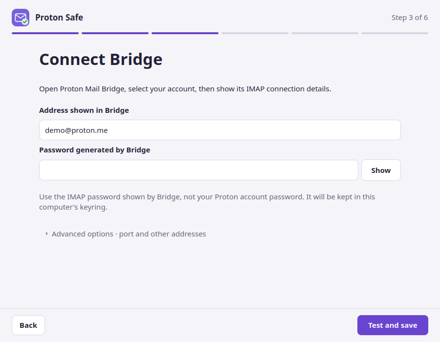

# Download Proton Safe

[Français](fr/telecharger.md)

**A guided app to connect Proton Mail to your local ChatGPT desktop / Codex assistant.**

## Choose your system

**Ubuntu 24.04 · Intel / AMD 64-bit (x86_64) — available.**
Version 2.1.2, a 68 MB `.deb`, published by François Bossière as an independent project:
free, MIT licensed, hosted on the official GitHub Release. Proton Mail Bridge and a
compatible paid Proton plan are required.
[Go to the installer](#get-the-installer) ·
[Release notes](https://github.com/fbossiere/proton-safe-mcp/releases/tag/v2.1.2)

**Windows 11 · 64-bit (x64) — not available yet.**
No Windows installer is published, and this page will not offer a build nobody has run:
the code is written but has not been validated on Windows. When it lands it will be a
signed `ProtonSafe-Setup-<version>-x64.exe` in the same release, installing for your
Windows account with no administrator password.
[Where the Windows version stands](windows-installer.md) ·
[Acceptance sheet](windows-acceptance.md)

macOS, ARM processors, WSL and phones are out of scope entirely.

## Before you download

You need all of the following on the **same computer**:

- **Ubuntu 24.04 LTS, Intel / AMD 64-bit (x86_64).** This installer is not for Windows,
  macOS, ARM, WSL or a phone.
- **[Proton Mail Bridge](https://proton.me/mail/bridge)** installed, running and signed in,
  with a paid Proton plan that includes Bridge.
- **A compatible local ChatGPT desktop / Codex installation.** A ChatGPT web account alone
  is not enough. The setup app checks whether your installed client supports the required
  plugin commands before making changes.
- **A graphical user session with a session keyring** (Secret Service, such as Ubuntu's
  `gnome-keyring`). Run the application as your normal user.

Python and `uv` are included. You do not need to install them or edit a configuration file.

!!! info "Before giving an assistant access to your mail"
    With a cloud AI model, the content of messages your assistant reads is sent to that
    provider. Proton Safe has no send, delete or move tools; confirmed drafts wait in
    Proton Mail for you to review and send. [Read the security model](security-model.md).

## Get the installer

[Download for Ubuntu — v2.1.2 · .deb · 68 MB](https://github.com/fbossiere/proton-safe-mcp/releases/download/v2.1.2/proton-safe-assistant_2.1.2_amd64.deb){ .md-button .md-button--primary }

Free, MIT licensed, hosted on the project's **official GitHub Release**. No GitHub account
is needed to download it. This is an independent project, not affiliated with or endorsed by Proton.

[Release notes and all files](https://github.com/fbossiere/proton-safe-mcp/releases/tag/v2.1.2)
· [Checksum file](https://github.com/fbossiere/proton-safe-mcp/releases/download/v2.1.2/proton-safe-assistant_2.1.2_amd64.deb.sha256)
· [Build provenance](https://github.com/fbossiere/proton-safe-mcp/releases/download/v2.1.2/BUILD-PROVENANCE.txt)

## Install, connect, try

1. **Open the downloaded `.deb` with your graphical package installer** and choose Install.
   Ubuntu may ask for your computer's administrator password to install the application.
2. **Launch Proton Safe** from the applications menu, as your normal user.
3. **Follow the guided checks.** Open Bridge to find its IMAP address and generated password.
   Enter those in Proton Safe. Your Proton account password belongs only in Bridge.
4. **Review the plan**, select your detected assistant and activate the connection. Reopen
   or restart your AI client if it has not loaded the new connection, then verify the tools
   there as the setup app requests.
5. **[Try your first three requests](try-it.md)** and tell us where the setup was easy or difficult.



*Actual interface render with demo data. It does not demonstrate a live mail connection.*

??? question "The file opens as an archive instead of an installer"
    Use **Open with** and select your software/package installer if one is installed.
    If your Ubuntu installation has none, the alternative is to open a terminal in your
    Downloads folder and run:

    ```bash
    sudo apt install ./proton-safe-assistant_2.1.2_amd64.deb
    ```

    Then launch **Proton Safe** normally, never with `sudo`.

??? info "Verify the download"
    Put the `.deb` and its `.sha256` file in the same folder. In a terminal in that folder:

    ```bash
    sha256sum -c proton-safe-assistant_2.1.2_amd64.deb.sha256
    ```

    The published v2.1.2 installer has SHA-256:

    ```text
    66ab3963e4ab0985d86a1d25dcbaea483e30bd0febd8ed1ec56183c96f83a567
    ```

    The published file is 71,015,644 bytes. The checksum detects a damaged or mismatched
    download. Obtain both files from the official release; a checksum is not a separate
    guarantee of the publisher's identity.

## Updates and removal

**Updates are manual.** Check the [release notes](https://github.com/fbossiere/proton-safe-mcp/releases)
before installing a newer official `.deb` over the existing version. Reopen Proton Safe,
check the connection, and restart your assistant so it loads the updated runtime.

To stop access, use **Disconnect Proton Safe** in the app first, then restart your AI client.
The app separately offers to erase its saved local settings and credential. A failed removal
keeps the information needed for a retry. Afterwards, you can uninstall the package with
Ubuntu's software manager. See [connection removal](desktop-assistant.md#after-installation).

## Another operating system or assistant?

This desktop installer currently targets Ubuntu 24.04 and local ChatGPT desktop / Codex.
Windows 11 x64 is [in development and not released](windows-installer.md).
For other MCP clients, see the [command-line setup](getting-started.md) and
[client guides](clients.md). These are separate, more technical installation paths;
this download does not add support for ChatGPT web or mobile.

If installation stops, keep the message visible and follow the
[troubleshooting guide](troubleshooting.md), or [report the step that blocked you](try-it.md#send-feedback).
