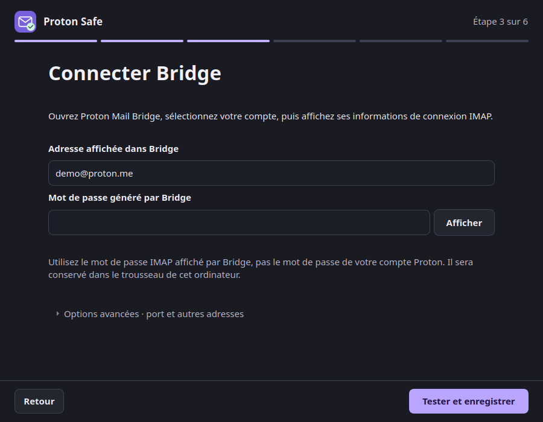

# Télécharger Proton Safe pour Ubuntu

[English](../download.md)

**Une application guidée pour connecter Proton Mail à votre assistant ChatGPT desktop / Codex en local.**

## Avant de télécharger

Il vous faut, sur le **même ordinateur** :

- **Ubuntu 24.04 LTS, Intel / AMD 64 bits (x86_64).** Ce paquet n’est pas destiné à Windows,
  macOS, ARM, WSL ou à un téléphone.
- **[Proton Mail Bridge](https://proton.me/mail/bridge)** installé, ouvert et connecté à
  votre compte, avec un forfait Proton payant qui inclut Bridge.
- **Une installation locale compatible de ChatGPT desktop / Codex.** Un compte ChatGPT
  dans le navigateur ne suffit pas. L’application vérifie que votre client dispose des
  commandes de plugin nécessaires avant de modifier quoi que ce soit.
- **Une session graphique avec un trousseau de session**, comme `gnome-keyring` sur Ubuntu.
  Lancez Proton Safe avec votre utilisateur habituel.

Python et `uv` sont inclus. Pas besoin de les installer ni de modifier un fichier de configuration.

!!! info "Avant de confier vos messages à un assistant"
    Avec un modèle d’IA dans le cloud, le contenu des messages lus par votre assistant est
    envoyé à son fournisseur. Proton Safe ne possède aucun outil d’envoi, de suppression ou
    de déplacement. Les brouillons confirmés attendent dans Proton Mail votre relecture et
    votre envoi. [Consulter le modèle de sécurité (EN)](../security-model.md).

## Obtenir le fichier

[Télécharger pour Ubuntu — v2.1.0 (.deb)](https://github.com/fbossiere/proton-safe-mcp/releases/download/v2.1.0/proton-safe-assistant_2.1.0_amd64.deb){ .md-button .md-button--primary }

Gratuit, sous licence MIT, hébergé dans la **version officielle du projet sur GitHub**.
Aucun compte GitHub n’est nécessaire pour le télécharger. Projet indépendant, non affilié à Proton
et sans approbation de sa part.

[Notes de version et tous les fichiers](https://github.com/fbossiere/proton-safe-mcp/releases/tag/v2.1.0)
· [Empreinte de contrôle](https://github.com/fbossiere/proton-safe-mcp/releases/download/v2.1.0/proton-safe-assistant_2.1.0_amd64.deb.sha256)
· [Provenance du paquet](https://github.com/fbossiere/proton-safe-mcp/releases/download/v2.1.0/BUILD-PROVENANCE.txt)

## Installer, connecter, essayer

1. **Ouvrez le `.deb` téléchargé avec votre installateur graphique de paquets**, puis choisissez
   Installer. Ubuntu peut demander le mot de passe administrateur de votre ordinateur.
2. **Lancez Proton Safe** depuis le menu des applications, avec votre utilisateur habituel.
3. **Suivez les vérifications.** Dans Bridge, retrouvez l’adresse IMAP et le mot de passe
   généré. Saisissez-les dans Proton Safe. Le mot de passe de votre compte Proton reste dans Bridge.
4. **Vérifiez le récapitulatif**, choisissez votre assistant détecté et activez la connexion.
   Rouvrez ou redémarrez votre client IA s’il n’a pas chargé la connexion, puis vérifiez
   les outils dans ce client, comme le demande l’application.
5. **[Essayez vos trois premières demandes](essayer.md)**, puis dites-nous ce qui vous a aidé ou bloqué.



*Rendu de l’interface réelle avec des données de démonstration. Ce n’est pas la preuve d’une connexion active.*

??? question "Le fichier s’ouvre comme une archive"
    Utilisez **Ouvrir avec** et choisissez votre installateur de logiciels ou de paquets,
    s’il est installé. Si votre Ubuntu n’en possède pas, l’alternative consiste à ouvrir
    un terminal dans le dossier contenant le fichier et à exécuter :

    ```bash
    sudo apt install ./proton-safe-assistant_2.1.0_amd64.deb
    ```

    Lancez ensuite **Proton Safe** normalement, jamais avec `sudo`.

??? info "Vérifier le fichier téléchargé"
    Placez le `.deb` et son fichier `.sha256` dans le même dossier. Depuis un terminal
    ouvert dans ce dossier :

    ```bash
    sha256sum -c proton-safe-assistant_2.1.0_amd64.deb.sha256
    ```

    L’empreinte SHA-256 du paquet publié en v2.1.0 est :

    ```text
    4ceebbfd0a12fe77ee46470397c9a6543a68ab85079aaa9ebc7eec72ad044dad
    ```

    Elle permet de détecter un fichier endommagé ou différent. Téléchargez les deux fichiers
    depuis la version officielle : cette empreinte n’est pas une garantie indépendante de
    l’identité de l’éditeur.

## Mettre à jour ou retirer la connexion

**Les mises à jour sont manuelles.** Consultez les
[notes de version](https://github.com/fbossiere/proton-safe-mcp/releases) avant d’installer un
nouveau `.deb` officiel par-dessus la version existante. Rouvrez Proton Safe, vérifiez la
connexion et redémarrez votre assistant pour qu’il charge la nouvelle version.

Pour arrêter l’accès, utilisez d’abord **Déconnecter Proton Safe** dans l’application, puis
redémarrez votre client IA. L’effacement des paramètres locaux et de l’identifiant est un
choix séparé. En cas de retrait refusé, les informations nécessaires à une nouvelle tentative
sont conservées. Vous pouvez ensuite désinstaller le paquet depuis le gestionnaire de
logiciels Ubuntu. [Détails sur le retrait (EN)](../desktop-assistant.md#after-installation).

## Un autre système ou assistant ?

Ce paquet cible Ubuntu 24.04 et ChatGPT desktop / Codex en local. Pour les autres clients MCP,
consultez [l’installation en ligne de commande (EN)](../getting-started.md) et les
[guides des clients (EN)](../clients.md). Ce sont des parcours plus techniques et distincts :
ce téléchargement n’ajoute pas de compatibilité avec ChatGPT web ou mobile.

Si l’installation bloque, gardez le message à l’écran et consultez le
[guide de dépannage (EN)](../troubleshooting.md), ou [signalez l’étape bloquante](essayer.md#donner-votre-avis).
